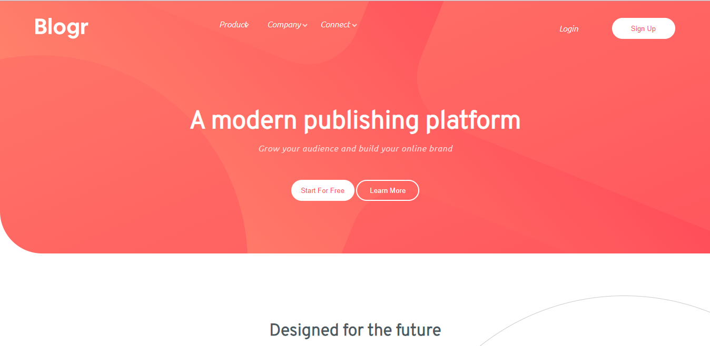

# Frontend Mentor - Blogr landing page solution

This is a solution to the [Blogr landing page challenge on Frontend Mentor](https://www.frontendmentor.io/challenges/blogr-landing-page-EX2RLAApP). Frontend Mentor challenges help you improve your coding skills by building realistic projects. 

## Table of contents

- [Overview](#overview)
  - [The challenge](#the-challenge)
  - [Screenshot](#screenshot)
  - [Links](#links)
- [My process](#my-process)
  - [Built with](#built-with)
  - [What I learned](#what-i-learned)
  - [Continued development](#continued-development)
  - [Useful resources](#useful-resources)
- [Author](#author)
- [Acknowledgments](#acknowledgments)


## Overview

### The challenge

Users should be able to:

- View the optimal layout for the site depending on their device's screen size
- See hover states for all interactive elements on the page

### Screenshot




### Links

- Solution URL: [View solution URL here](https://github.com/DanglingGem/blogr-landing-page.git)
- Live Site URL: [View live site URL here]( https://danglinggem.github.io/blogr-landing-page/)

## My process

### Built with

- Semantic HTML5 markup
- CSS custom properties
- Flexbox
- CSS Grid

**Note: These are just examples. Delete this note and replace the list above with your own choices**

### What I learned

How to create dropdowns with HTML5 and CSS

To see how you can add code snippets, see below:

```html
 <ul class="dropdown">
                        <li class="dropdown-list">
                            <a href="#">Overview</a>
                        </li>
                        <li class="dropdown-list">
                            <a href="#">Pricing</a>
                        </li>
                        <li class="dropdown-list">
                            <a href="#">Marketplace</a>
                        </li>
                        <li class="dropdown-list">
                            <a href="#">Features</a>
                        </li>
                        <li class="dropdown-list">
                            <a href="#">Integration</a>
                        </li>
                    </ul>
```
```css
.dropdown{
    background: var(--clr-text);
    transition: all 0.3s linear;
    padding: 1rem;
    border-radius: 4px;
    font-size: 14px;
    box-shadow: 0 5px 15px #fa6c75;
    display: none;
    position: absolute;
}
```
```js
const hamburger = document.querySelector(".nav-toggle img");
const mobileMenu =document.querySelector(".mobile-menu");


btnClickHandler = () => {
    console.log("working...");

    if (hamburger.classList.contains("change")) {
        hamburger.classList.toggle("change");
        hamburger.setAttribute("src", "./blogr-landing-page-main/images/icon-hamburger.svg");
        mobileMenu.classList.remove("mobile-active");
    }else{
        hamburger.classList.toggle("change");
        hamburger.setAttribute("src", "./blogr-landing-page-main/images/icon-close.svg");
        hamburger.setAttribute("alt", "close button");
        mobileMenu.classList.add("mobile-active");
    }
};

hamburger.addEventListener("click", () => btnClickHandler());
```


### Continued development

JavaScript functions


## Author


- Frontend Mentor - [@DanglingGem](https://www.frontendmentor.io/profile/DanglingGem)
- Twitter - [@danglinggem](https://www.twitter.com/danglinggem)


## Acknowledgments

A big "THANK YOU" to Frontendmentor.io for this platform.